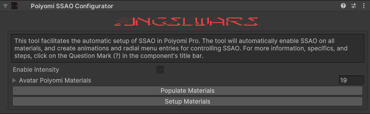
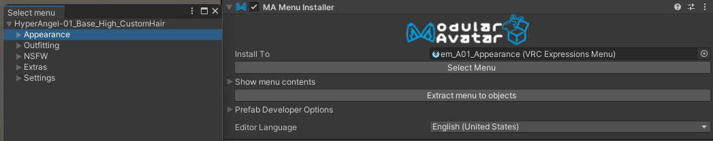

This tool facilitates the automatic setup of SSAO in Poiyomi Pro. The tool will automatically enable SSAO on all compatible materials, and create animations for controlling SSAO.

### Usage

To use the tool simply add the prefab of your choice to the root of your avatar.

The prefab can be found at `Packages/AW_AT/Editor/Prefabs/*`, there are two variants.

1. Click on the prefab.
2. SSAO_WithIntensity: This is the version that includes an intensity radial. This variant requires 10 bits of parameter space.
3. SSAO_NoIntensity: This variant only includes on/off control for the light and the effect. This variant only requires 2 bits of parameter space.

After adding the prefab you must setup your materials, this can be done by either manually enabling SSAO on select materials, or using the tool provided to do it all at once. 

To use the latter:
1. Populate all materials by clicking on the `Populate Materials` button. This should create and fill a list of all found Poiyomi 9.2+ materials on the avatar.
2. Enable SSAO on all materials by clicking on the `Setup Materials` button.
:::caution
When using the tool to enable SSAO on all materials, all materials will be unlocked! This can cause a crash on very complex materials. Read > Poiyomi: [64 Texture Slot Crash](https://www.poiyomi.com/general/textures-64-texture-slot-crash)
:::
This will unlock all materials, enable SSAO, and add a depth light to the avatar.

After this, your avatar should be ready to upload with SSAO options added to your root menu.

To move the menu to a different place in your menu hierarchy please take a look at Moving Menus below.

### What Happens at Runtime (Building the Avatar)

When the avatar is built, the tool runs a few steps via NDMF.

1. Initializes a new animator layer with a DBT.
2. Creates animations for both intensity (if enabled in the component), and the enabling of the effect.
3. Attempts to find all Depth Lights (if any) on the avatar. The tool searches for depth lights by name, currently we don't look for all directional lights as to avoid messing up any other features of an avatar. The tool then deletes all of these depth lights, and creates a fresh one. This ensures there is always only one depth light on the avatar at a time.
4. Creates an animation for the enabling of the depth light and disables the light by default.
5. Finally, the animator is merged using MaAc and parameters are generated based on preferences.

### Moving the Menu

In order to simplify the process of adding menus, all of my tools utilize Modular Avatar's menu installer. By default, the menus will install into a submenu in the root of your expressions menu. If you would like to move this, say to an 'Appearance' menu, you can do so with the steps below:
1. Click on the prefab.
2. Click on `Select Menu` in the Modular Avatar Menu Installer component.
3. Select the menu you would like to install into.

